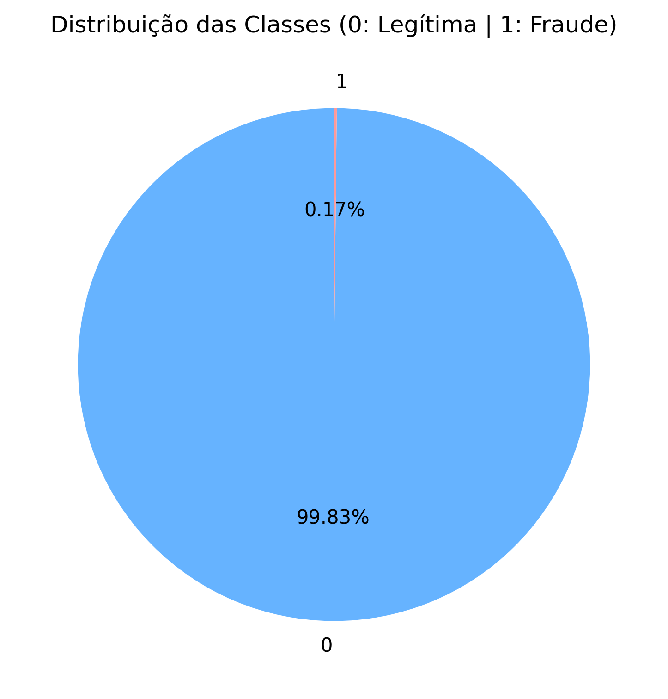
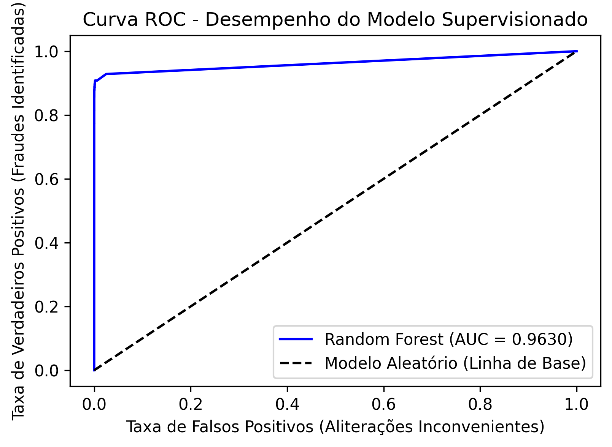

# Fraud Detection using Machine Learning

## Descrição
Este projeto foi desenvolvido como parte do desafio de Machine Learning da DIO, com foco na detecção de fraudes em transações financeiras utilizando técnicas de aprendizado de máquina supervisionado e não supervisionado.

A proposta consiste em analisar padrões de comportamento presentes em transações financeiras, identificar anomalias e avaliar a capacidade de diferentes algoritmos em detectar operações potencialmente fraudulentas.

Além do aspecto técnico, o projeto busca demonstrar como soluções baseadas em Machine Learning podem apoiar a tomada de decisão em cenários reais de gestão de risco, prevenção de perdas e segurança financeira.

## Objetivos
* Realizar análise exploratória dos dados (EDA).
* Identificar padrões associados a transações fraudulentas.
* Detectar anomalias utilizando algoritmos não supervisionados.
* Construir modelos supervisionados para classificação de fraudes.
* Comparar o desempenho dos modelos através de métricas estatísticas.
* Gerar visualizações para interpretação dos resultados.
* Demonstrar aplicações práticas de Machine Learning no contexto financeiro.

## Dataset

### Fonte dos Dados
Dataset disponibilizado pelo TensorFlow:
https://storage.googleapis.com/download.tensorflow.org/data/creditcard.csv

### Descrição das Variáveis
| Variável | Descrição |
| :--- | :--- |
| **V1 a V28** | Componentes resultantes de transformação PCA para anonimização dos dados |
| **Amount** | Valor da transação |
| **Class** | Indicador de fraude |

### Variável Alvo
* **Class = 0** → Transação legítima
* **Class = 1** → Transação fraudulenta

O dataset apresenta um cenário realista de forte desbalanceamento entre transações legítimas e fraudulentas, característica comum em problemas de fraude financeira.

## Tecnologias Utilizadas
* Python
* Pandas
* NumPy
* Matplotlib
* Seaborn
* Scikit-Learn
* Jupyter Notebook

## Metodologia
O desenvolvimento do projeto foi dividido em quatro etapas principais.

### 1. Análise Exploratória dos Dados (EDA)
Nesta etapa foram realizadas a inspeção da estrutura dos dados, verificação de valores ausentes e análise do balanceamento das classes. 

**Distribuição do Volume de Fraudes identificada na Operação:**


* **Notebook:** `notebooks/01_exploratory_analysis.ipynb`

### 2. Detecção de Anomalias com Isolation Forest
O algoritmo Isolation Forest foi utilizado para identificar observações incomuns sem necessidade de rótulos prévios (abordagem não supervisionada).
* **Notebook:** `notebooks/02_isolation_forest.ipynb`

### 3. Detecção de Anomalias com Local Outlier Factor (LOF)
O Local Outlier Factor identifica observações anômalas com base na densidade local dos dados, avaliando comportamentos atípicos localizados.
* **Notebook:** `notebooks/03_lof_model.ipynb`

### 4. Classificação Supervisionada com Random Forest
A Random Forest foi aplicada para classificar transações legítimas e fraudulentas utilizando os rótulos disponíveis no dataset. Apresentou alta robustez contra overfitting e excelente capacidade de generalização.

**Curva ROC - Avaliação de Sensibilidade do Modelo Supervisionado:**


* **Notebook:** `notebooks/04_random_forest.ipynb`

## Métricas Avaliadas & Visão de Negócio
Os modelos foram avaliados através das métricas mais utilizadas em problemas de classificação e detecção de fraude:
* Accuracy
* Precision
* Recall
* F1-Score
* ROC Curve / AUC (Area Under Curve)

> **Abordagem de Inteligência de Mercado:** Como o dataset é altamente desbalanceado, métricas como o **Recall** receberam atenção especial. No cenário de fraudes, um *Falso Negativo* (deixar uma fraude passar) custa muito mais caro para a instituição financeira em chargebacks do que um *Falso Positivo* (bloquear preventivamente uma transação legítima).

## Resultados & Insights
* A **Random Forest apresentou o melhor desempenho geral**, alcançando a maior estabilidade e equilíbrio entre detecção e falsos positivos (como demonstrado pelo alto índice AUC).
* Os modelos de detecção de anomalias (Isolation Forest e LOF) mostraram grande potencial para cenários "frios", onde a empresa ainda não possui dados históricos rotulados.
* Alta acurácia não necessariamente representa um bom modelo para fraude, visto que uma base com 99% de transações legítimas gerará alta acurácia mesmo que o modelo decida aprovar tudo.
* O uso combinado de técnicas supervisionadas e não supervisionadas pode aumentar drasticamente a robustez dos sistemas de prevenção a fraudes de fintechs e meios de pagamento.

## Estrutura do Projeto
```text
fraud-detection-ml/
│
├── notebooks/
│   ├── 01_exploratory_analysis.ipynb
│   ├── 02_isolation_forest.ipynb
│   ├── 03_lof_model.ipynb
│   └── 04_random_forest.ipynb
│
├── reports/
│   ├── fraud_distribution.png
│   └── roc_curve.png
│
├── src/
│   ├── __init__.py
│   └── data_loader.py (opcional)
│
├── requirements.txt
├── README.md
└── main.py
```

## Aplicação no Mundo Real

* A detecção de fraudes via Machine Learning consolida-se como uma das ferramentas mais cruciais e estratégicas de inteligência e compliance no setor financeiro atual.
* Bancos, fintechs e adquirentes utilizam modelos semelhantes para o desenvolvimento de sistemas automatizados de monitoramento transacional e bloqueios preventivos em tempo real.
* A correta calibração desses algoritmos serve de apoio para sistemas de gestão de risco, reduzindo as elevadas perdas financeiras geradas por chargebacks.
* A aplicação prática destes modelos mitiga os riscos operacionais da operação, otimizando os resultados e garantindo a sustentabilidade financeira dos meios de pagamento.

## Autor

* Jackelinne Rodrigues
* MBA em Neurociência, Marketing e Consumo
* Analista de Mercado & Growth Intelligence
* Especialista em análise de dados, inteligência de mercado e aplicação de dados para suporte à tomada de decisão estratégica.
